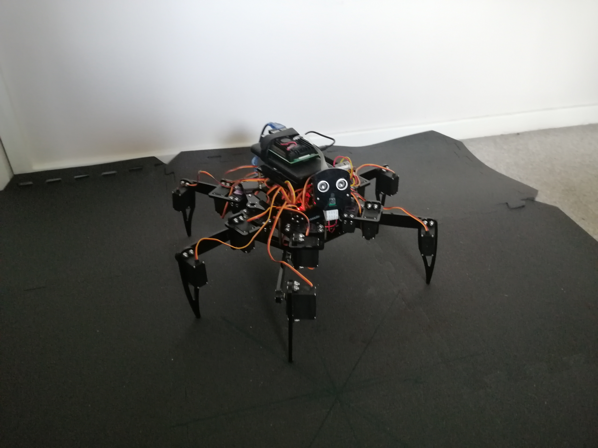

# 3rd Year University Project - Hexapod Robot

## Overview
This was my 3rd Year university project that was done across the year.

It involved building and programming a Hexapod Robot which ended up including for hand pose/gesture recognition and face detection.

It can be manually controlled through a Server-Client setup over LAN, with the robots POV being streamed to the client program.
The Client program process the the video frames through the ML models which was received from the Robot's communication server on the Raspberry Pi.

The communication server was deployed directly on the robot (on the Pi), and the main connection hub all the LAN connections for streaming IO data. It also handle communications with the Arduino Mega.

The Arduino Mega was in charge of controlling all the hexapods servos, and was where the Inverse Kinematic calculations where performed for translating/moving the robots limbs.

## System Architecture Diagram

## Misc.

I do want to revisit this project again, whether that is on this repo or in a new repo (as a new project), as I had no real practical experience with working on a robot and have learned a lot since then which I think I could do better. 